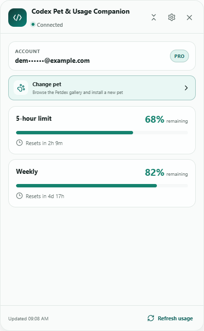
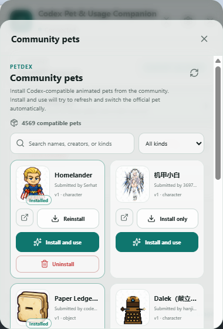
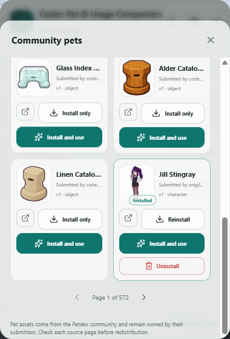

# Codex Pet & Usage Companion

[](https://github.com/Nemo0000/codex-pet-usage-companion/actions/workflows/ci.yml)
[](https://opensource.org/licenses/MIT)

Codex Pet & Usage Companion is an independent, local-first Windows tray app for switching community Codex pets and viewing ChatGPT-backed usage limits from one compact panel.

> This is an independent open-source project. It is not an official OpenAI product.

## Highlights

- View remaining percentage for the current Codex rate-limit windows.
- See reset countdowns in a compact, always-on-top panel.
- Run from the Windows notification area without occupying the taskbar.
- Move between compact and expanded layouts.
- Use light, dark, or system themes.
- Start with Windows when desired.
- Use the official browser sign-in flow when the local Codex session needs authentication.
- English and Simplified Chinese interface support.
- Open the Petdex community gallery directly from the homepage with **Change pet**.
- Browse thousands of community-made Petdex pets with search, kind filters, attribution, and installed-state indicators.
- Install a Petdex pet into `.codex/pets`, or install it and immediately attempt to select it in the official Codex desktop app.
- Automatically launch the official desktop app and navigate to Settings > Pets when the Windows UI allows it.
- Configure an optional ChatGPT/Codex executable path when automatic discovery is unavailable.
- Uninstall a locally installed Petdex package without touching official client files.

## Screenshots

### Usage monitor



### Pet switcher (English)

These live captures use the Petdex manifest and real community pet artwork, including installed-state and uninstall examples:





## How it works

The app launches `codex app-server` locally and communicates over its stable `stdio` transport. It does not scrape ChatGPT pages, read browser cookies, or upload usage data. Email addresses are masked in the UI, and raw protocol messages and access tokens are never logged.

### Petdex community gallery

The app includes an in-app client for the public [Petdex](https://petdex.dev/) manifest. It does not run a second floating mascot: it downloads the selected community package, validates its trusted asset URLs, metadata, size, image format, and v1/v2 sprite grid, then installs it under `.codex/pets/<pet-id>` for the official Codex app.

**Install only** adds the package without changing the active pet. **Install and use** refreshes the official Pets page, launches the desktop app when a trusted local executable is available, opens Settings > Pets through visible Windows UI Automation, invokes the visible **Select** button, and checks for the **Selected** state. If navigation or UI automation is unavailable, the package remains safely installed and the app asks the user to select it manually.

Pet assets remain owned by their Petdex submitters. The gallery links to each source page so users can review attribution and licensing before redistributing an asset.

## Download

Download the latest Windows x64 installer from [GitHub Releases](https://github.com/Nemo0000/codex-pet-usage-companion/releases).

The initial release is an unsigned installer. Windows may display a warning before installation; users should verify the release source and checksum before running a downloaded installer.

## Requirements

- Windows 10 or Windows 11 (x64)
- Microsoft Edge WebView2 Runtime
- Codex CLI with `codex app-server` support
- A ChatGPT-backed Codex sign-in for subscription rate-limit information
- Internet access to `petdex.dev` and `assets.petdex.dev` when browsing or installing community pets

Check the CLI from PowerShell before launching the app:

```powershell
codex --version
codex app-server --help
```

## Installation and first run

1. Download the latest `Codex Pet & Usage Companion_*_x64-setup.exe` installer from the release page.
2. Run the installer for the current Windows user.
3. Launch Codex Pet & Usage Companion from the Start menu or desktop shortcut.
4. If Codex is not signed in, choose **Reconnect** and complete the official browser flow.
5. Use the tray icon to show or hide the panel. Closing the panel hides it instead of exiting the app.

For **Install and use**, keep the official desktop app installed. The companion first tries standard Windows locations, then the optional path in Settings. You can still open Settings > Pets manually if the official UI does not expose the expected controls.

## Development

Development prerequisites:

- Node.js `20.19+`, `22.12+`, or a newer supported release
- Rust `1.96.0` (selected automatically by `rust-toolchain.toml`)
- Visual Studio 2022 Build Tools with the **Desktop development with C++** workload and a Windows SDK

Install dependencies and run the checks:

```powershell
npm install
npm run check
npm test
npm run build
```

Start the Tauri development app:

```powershell
npm run tauri dev
```

Build the Windows installer:

```powershell
npm run tauri build
```

The NSIS installer is written under `src-tauri/target/release/bundle/nsis/`.

## Troubleshooting

### Codex CLI not found

Confirm that `codex --version` works in a new terminal, then restart the companion. Set `CODEX_CLI_PATH` to an explicit executable or command-shim path when the CLI is not on `PATH`.

### Usage information is unavailable

Subscription rate-limit information requires a ChatGPT-backed Codex account. API-key-only and Bedrock authentication may not expose these usage windows. Use **Reconnect** and complete the official browser flow.

### The panel disappeared

The close button hides the panel. Use the tray icon to show it again, or right-click the tray icon and choose **Show panel**.

### Automatic pet switching did not finish

The bridge uses only visible Windows UI Automation. Confirm the official desktop app is installed, optionally set its `.exe` path under **Settings > Official desktop app**, and retry **Install and use**. If navigation is unavailable after an official UI update, select the newly installed pet manually on Settings > Pets; the package remains safely installed.

## Current scope

Version `0.4.1` includes the Petdex community gallery, validated v1/v2 package installation, installed-pet management, automatic official desktop launch, menu fallback, Settings > Pets navigation, and the verified Windows UI Automation bridge used by **Install and use**. The homepage **Change pet** entry opens the gallery directly. Settings contains general preferences plus an optional official desktop executable path. Community packages are written only under `.codex/pets`; official client installation files are not modified.

## Roadmap

- Improve release packaging and signing for wider distribution.
- Add more robust diagnostics that remain privacy-safe.
- Evaluate additional usage windows and account actions based on official Codex App Server support.
- Add read-only reset-credit visibility when the official App Server exposes it reliably.
- Add more languages and local usage history.
- Add explicit community-pet update and uninstall controls with package ownership checks.

See [CHANGELOG.md](./CHANGELOG.md) for release history.

## License

Codex Pet & Usage Companion is released under the [MIT License](./LICENSE).
